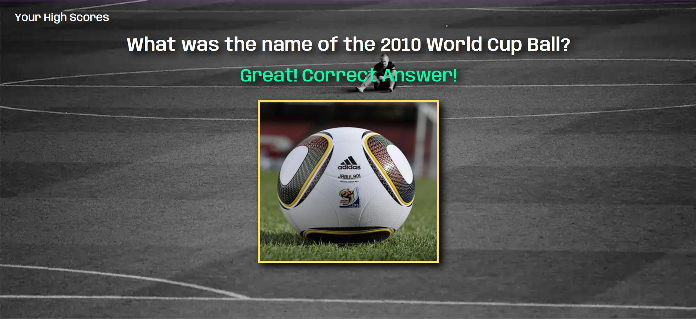
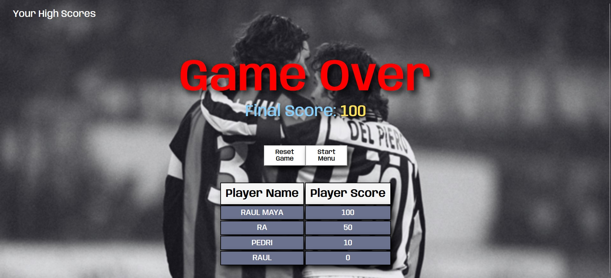
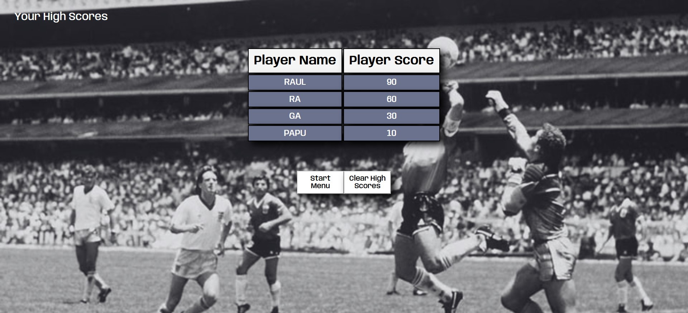

<!-- PROJECT LOGO -->
 

  

  <h2 align="center">Hardest Football Quiz</h2>
  <h4 align="center">Web APIs & JavaScript Project</h4>

  

  This project consist in a challenging quiz, with 10 questions about football that will even put to sweat to true fans of this sport. Give it a try, and check how much you know about football.
     
     
    <a href="https://github.com/RaulMaya/Football-Quiz">Repository</a>    
    ·
    <a href="https://raulmaya.github.io/Football-Quiz/">Deployment</a>
    ·
    <a href="https://www.linkedin.com/in/raul-maya/">My LinkedIn</a>

  

<!-- ABOUT THE PROJECT -->

### About The Project
 

This project was created using tools such as JavaScript, Web APIs and Browser tools. The quiz will start once the user click on the "Start Quiz" button. When the quiz starts, 10 random questions will be deployed with their four possible answers, the user will have a limit of 10 seconds per question.

 

If the user exceed the time, the question will be taken as wrong, and automatically will pass to the next question.

 

The only way that the user can score points, is by correctly answer the question.

 

At the end of the 10 questions, the app will land the user his total score, and the user will need to fill a form with his name, to keep track of the highscore list of every user the has played the game.

 

Last but not least, the user will have the ability to track the progress and the highscore table, since it is a local game, the user can restore this highscores table by clicking on the button "Clear High Scores.

### Contact :iphone:

- Name: Raul Maya Salazar
- Phone: +52 833 159 7006
- E-mail: raulmayas20@gmail.com
- GitHub: https://github.com/RaulMaya
- LinkedIn: https://www.linkedin.com/in/raul-maya/

(<a href="#top">back to top</a>)
